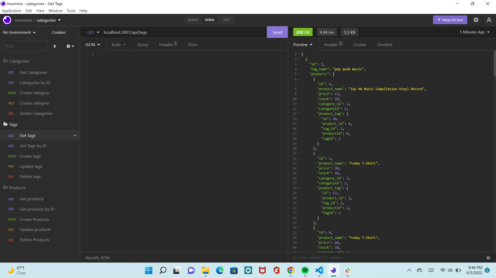

# backend-ecommerce
## Description
This application helps an ecommerce website use latest technologies to be competetive.

## Table of Contents
* [Usage](#Usage)
* [Video-Link](#Video-Link)
* [Credits/Citations](#Credits/Citations)
* [Features](#Features)
* [Applications-Used](#Applications-Used)
* [Screenshots](#Screenshots)

## Usage
A back-end application for an e-commerce website. A working Express.js API was used and configured to use Sequelize to interact with a MySQL database. Using latest technologies, this application will enable an ecommerce website to be competetive.

## Video-Link
Please note I ran out of the five minute limit for screencastify to record my demo in one video which is why there are two videos included for this assignment. In the first video, I start the application by seeding the database, creating the schema, and start the application from my terminal. The first video shows the GET,PUSH,PUT,DEL for Categories and Tags. In the second video I demonstrate GET,PUSH,PUT,DEL only for Products since I ran out of recording time in the first video.
**[Click here for video link to the first video in this two-part demo](https://youtu.be/lgDS8Ij_rAU)**
**[Click here for video link to the second video in this two-part demo](https://youtu.be/KJh3Wpj8udE)**

## Credits/Citations
* Tutor Abdullah explained how to use sequelize and establish my routes
* Lesson 13 
* Insomnia Documentation
* Starter code provided with challenge assignment

## Features
The features of this application meet the following acceptance criteria
* GIVEN a functional Express.js API
* WHEN I add my database name, MySQL username, and MySQL password to an environment variable file
* THEN I am able to connect to a database using Sequelize
* WHEN I enter schema and seed commands
* THEN a development database is created and is seeded with test data
* WHEN I enter the command to invoke the application
* THEN my server is started and the Sequelize models are synced to the MySQL database
* WHEN I open API GET routes in Insomnia for categories, products, or tags
* THEN the data for each of these routes is displayed in a formatted JSON
* WHEN I test API POST, PUT, and DELETE routes in Insomnia
* THEN I am able to successfully create, update, and delete data in my database

## Applications-Used
* MySQL
* Insomnia
* Express
* Markdown
* JavaScript

## Screenshots
See below screenshots

